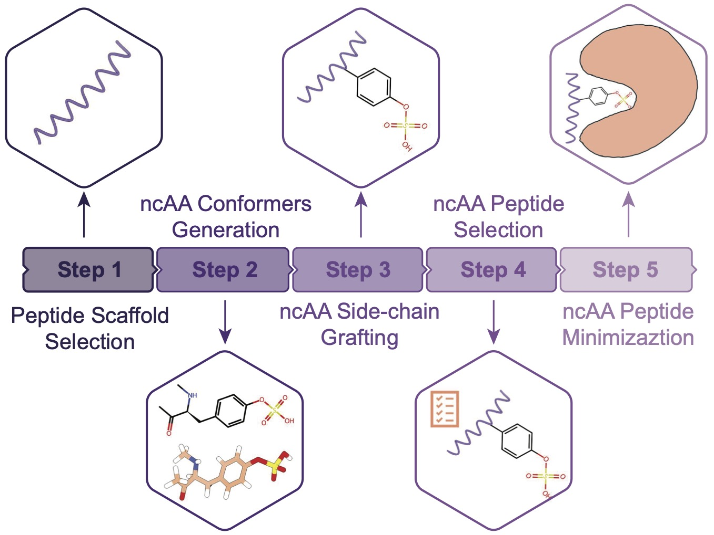

# ResidueX



A Python package for generating non-canonical amino acid (ncAA) peptides by integrating ncAA structures into existing peptide backbones.

**Co-authored by:** Dr. Rui Wang <rw3594@nyu.edu> <https://github.com/wangru25>

## Overview

ResidueX is a computational tool designed for molecular modeling and peptide engineering. It allows users to:

- Split PDB files by specific residue IDs
- Generate conformers for non-canonical amino acids (ncAAs)
- Integrate ncAA structures into peptide backbones
- Create modified peptides with custom amino acid substitutions

## Installation

### Prerequisites

Before installing ResidueX, you need to have the following installed:

1. **Conda** (Anaconda or Miniconda)
2. **Python 3.9+** (recommended)

### Installing ResidueX

#### Option 1: Using Conda Environment (Recommended)

The easiest way to install ResidueX is using the provided conda environment file, which includes all required dependencies:

1. Clone the repository:
```bash
git clone https://github.com/your-username/ResidueX.git
cd ResidueX
```

2. Create and activate the conda environment:
```bash
conda env create -f python39_environment_2025Jul22.yml
conda activate python39
```

3. Install ResidueX in development mode:
```bash
pip install -e .
```

This environment includes all necessary dependencies:
- **Biopython** (1.76)
- **RDKit** (2022.9.2)
- **NumPy** (1.22.3)
- **Pandas** (1.4.4)
- **Matplotlib** (3.5.2)
- **Scikit-learn** (1.1.3)
- **RMSD** (1.4)
- **Open Babel** (3.1.1)
- **Jupyter** and other scientific computing tools

#### Option 2: Manual Installation

1. Clone the repository:
```bash
git clone https://github.com/your-username/ResidueX.git
cd ResidueX
```

2. Install the package in development mode:
```bash
pip install -e .
```

If you prefer to install dependencies manually (not recommended), you'll need to install:

```bash
pip install biopython==1.76
pip install rdkit==2022.9.2
pip install numpy==1.22.3
pip install pandas==1.4.4
pip install matplotlib==3.5.2
pip install scikit-learn==1.1.3
pip install rmsd==1.4
```

**Note:** Manual installation may lead to version conflicts. We strongly recommend using the conda environment approach.

### Verifying Installation

After installation, you can verify that ResidueX is working correctly by running:

```python
from ResidueX.residuex import split_pdb_by_residue
from ResidueX.generate_conformer import GenerateConformer
from ResidueX.utils import pair_files_in_directory

print("ResidueX installed successfully!")
```

## Quick Start

### Basic Usage

```python
from ResidueX.residuex import split_pdb_by_residue, NCAA_sdf_generation, integrate_NCAA_into_peptide

# Split a PDB file by residue ID
split_pdb_by_residue(
    input_pdb_file="peptide.pdb",
    residue_id=8,
    output_residue_file="residue.pdb",
    output_rest_file="rest.pdb"
)

# Generate ncAA conformers
NCAA_sml = 'CN[C@@H](CC1=CN(C)C=N1)C(=O)C'  # SMILES string for your ncAA
NCAA_sdf_generation(NCAA_sml, "residue.pdb", "ncAA_conformers/")

# Integrate ncAA into peptide
integrate_NCAA_into_peptide(
    each_ncaa_SDF_path="ncAA_conformers/01.sdf",
    residue_id=8,
    input_pep_pdb_path="peptide.pdb",
    output_pep_pdb_path="peptide_ready.pdb",
    NCAA_peptide_SDF_path="output/ncaa_peptide.sdf",
    distance_info_txt_path="output/distance_info.txt"
)
```

## Tutorial

For a comprehensive tutorial on how to use ResidueX for ncAA peptide generation, please refer to:

**📖 [Tutorial Notebook](./tutorial_ncAA_peptide_generation.ipynb)**

This Jupyter notebook provides:
- Step-by-step examples
- Detailed explanations of each function
- Real-world use cases
- Visualization of results

## Examples

The `example/` directory contains sample data and results:

- `6ox2_Z/`: Example PDB structure with generated ncAA peptides
- `natural_peptide.png`: Visualization of natural peptide structure
- `ncAA_peptide.png`: Visualization of ncAA-modified peptide
- `ncAA.png`: Visualization of non-canonical amino acid structure

You can run the example script to see ResidueX in action:

```bash
python ResidueX_example.py
```

## Main Functions

### Core Functions

- `split_pdb_by_residue()`: Split PDB files by residue ID
- `NCAA_sdf_generation()`: Generate conformers for non-canonical amino acids
- `integrate_NCAA_into_peptide()`: Integrate ncAA structures into peptide backbones
- `read_sdf_to_Mol()`: Read SDF files into RDKit molecule objects
- `filter_residue_atoms()`: Filter specific atoms from residue structures

### Utility Functions

- `pair_files_in_directory()`: Organize and pair files in directories
- `GenerateConformer`: Generate molecular conformers

## File Structure

```
ResidueX/
├── ResidueX/                 # Main package directory
│   ├── residuex.py          # Core functionality
│   ├── generate_conformer.py # Conformer generation
│   └── utils.py             # Utility functions
├── example/                  # Example data and results
├── image/                    # Package images
├── python39_environment_2025Jul22.yml  # Conda environment file
├── tutorial_ncAA_peptide_generation.ipynb  # Tutorial notebook
├── ResidueX_example.py      # Example script
└── setup.py                 # Package setup
```

## Dependencies

The following packages are included in the conda environment (`python39_environment_2025Jul22.yml`):

### Core Dependencies
- **Biopython** (1.76): PDB file handling and molecular structure manipulation
- **RDKit** (2022.9.2): Molecular informatics and cheminformatics
- **NumPy** (1.22.3): Numerical computing
- **Pandas** (1.4.4): Data manipulation and analysis
- **Matplotlib** (3.5.2): Plotting and visualization
- **Scikit-learn** (1.1.3): Machine learning utilities
- **RMSD** (1.4): Root mean square deviation calculations
- **Open Babel** (3.1.1): Molecular format conversion

### Additional Scientific Computing Tools
- **Jupyter**: Interactive computing and notebooks
- **SciPy** (1.9.3): Scientific computing
- **Seaborn** (0.12.1): Statistical data visualization
- **NetworkX** (3.2.1): Complex network analysis
- **ProDy** (2.2.0): Protein dynamics analysis
- **MDTraj** (1.9.7): Molecular dynamics trajectory analysis

## Citation

If you use ResidueX in your research, please cite:

```
ResidueX: A Python package for non-canonical amino acid peptide generation
Authors: [Your Name], Dr. Rui Wang
```

## Contributing

We welcome contributions! Please feel free to submit issues, feature requests, or pull requests.

## License

[Add your license information here]

## Contact

For questions or support, please contact:
- Dr. Rui Wang: rw3594@nyu.edu
- GitHub: https://github.com/wangru25
